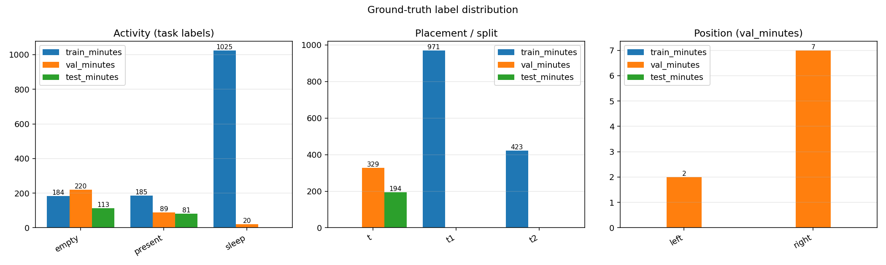
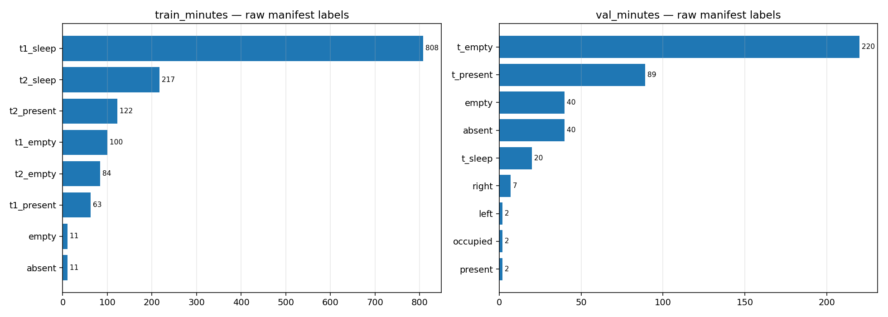
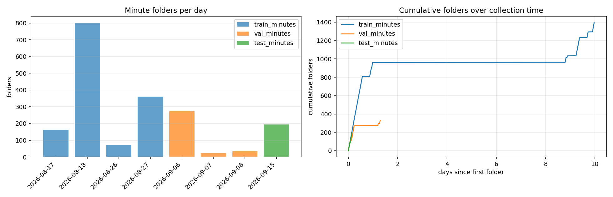
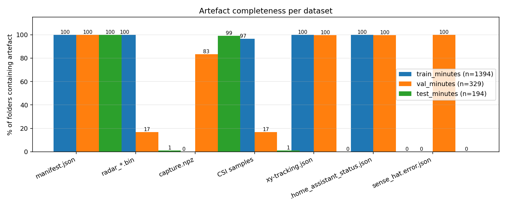
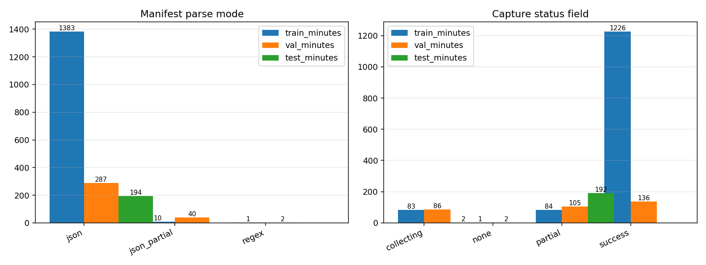
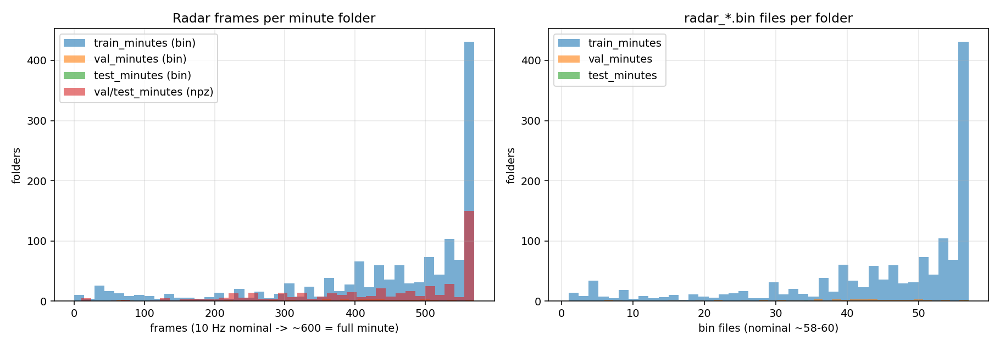
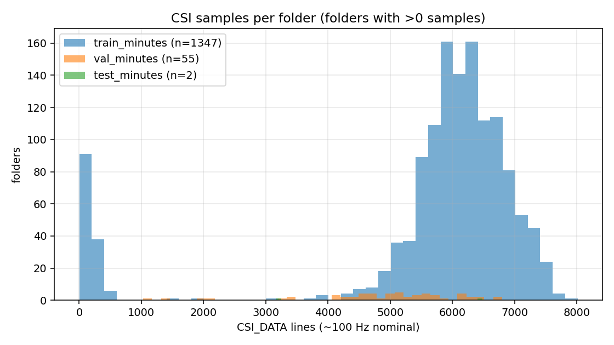
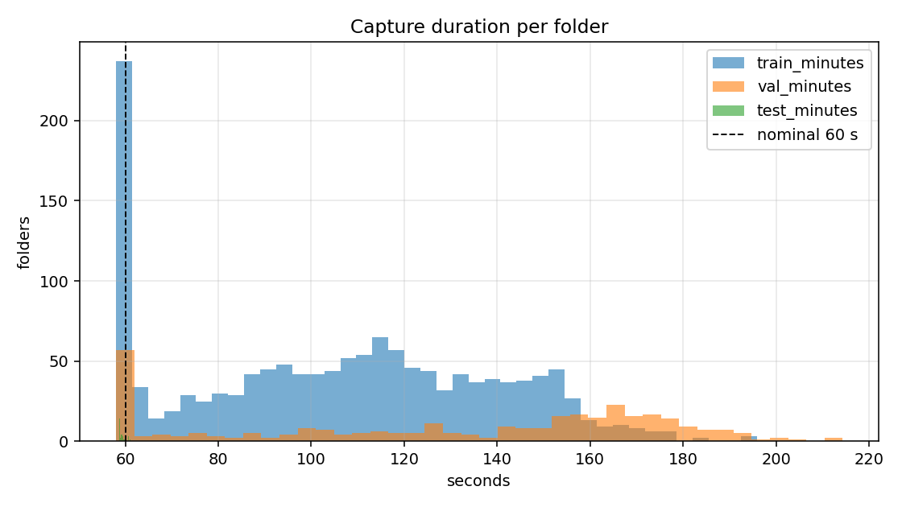
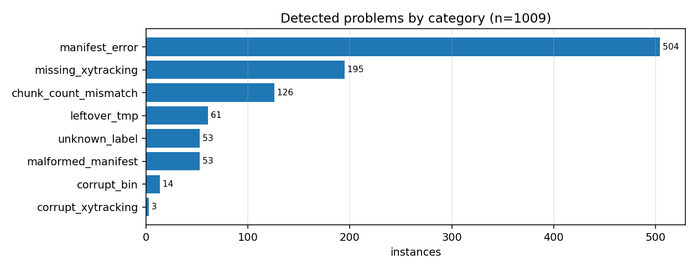

# E1 — Dataset Audit Report

Exploratory inspection of `train_minutes/`, `val_minutes/` and `test_minutes/`: file completeness, manifest health, label taxonomy, sensor coverage, timing, and a catalog of every missing/corrupt instance.

## 1. Overview
| dataset | folders | empty | with manifest | size | radar .bin files | radar frames (bin) | CSI lines | .tmp leftovers |
|---|---|---|---|---|---|---|---|---|
| train_minutes | 1394 | 0 | 1394 | 34.10 GB | 61849 | 618350 | 7518261 | 30 |
| val_minutes | 329 | 0 | 329 | 6.32 GB | 2093 | 20930 | 270525 | 30 |
| test_minutes | 194 | 0 | 194 | 4.57 GB | 91 | 910 | 9649 | 1 |

## 2. Labels
Task labels: `t1_*`/`t2_*` in `train_minutes/` (placements t1/t2), `t_*` in `val_minutes/` (placement t), and plain `empty`/`present` in `test_minutes/` (placement t, newer naming). `left`/`right` position labels and the `radar-missing` flag appear in `val_minutes/`. `absent`/`occupied` are auxiliary auto-labels written by the recorder (stripped from train/val manifests by `E2/clean_minutes.py`).

### train_minutes (1394 folders)

**Activity (task) labels**
| activity | folders |
|---|---|
| empty | 184 |
| present | 185 |
| sleep | 1025 |

**Placement**
| placement | folders |
|---|---|
| t1 | 971 |
| t2 | 423 |

**Raw manifest labels**
| label | occurrences |
|---|---|
| t1_sleep | 808 |
| t2_sleep | 217 |
| t2_present | 122 |
| t1_empty | 100 |
| t2_empty | 84 |
| t1_present | 63 |
| absent | 11 |
| empty | 11 |

Label status: `{"ok": 1394}`

### val_minutes (329 folders)

**Activity (task) labels**
| activity | folders |
|---|---|
| empty | 220 |
| present | 89 |
| sleep | 20 |

**Placement**
| placement | folders |
|---|---|
| t | 329 |

**Position**
| position | folders |
|---|---|
| left | 2 |
| none | 320 |
| right | 7 |

**Raw manifest labels**
| label | occurrences |
|---|---|
| t_empty | 220 |
| t_present | 89 |
| absent | 40 |
| empty | 40 |
| t_sleep | 20 |
| right | 7 |
| present | 2 |
| occupied | 2 |
| left | 2 |

Label status: `{"ok": 329}`

### test_minutes (194 folders)

**Activity (task) labels**
| activity | folders |
|---|---|
| empty | 113 |
| present | 81 |

**Placement**
| placement | folders |
|---|---|
| t | 194 |

**Raw manifest labels**
| label | occurrences |
|---|---|
| empty | 113 |
| present | 81 |

Label status: `{"ok": 194}`

## 3. Manifest health
### train_minutes
- Parse modes: `{"json": 1383, "regex": 1, "json_partial": 10}`
- Capture status: `{"success": 1226, "collecting": 83, "partial": 84, "none": 1}`
- Schema versions: `{"thoth-minute-manifest/v5": 1320, "thoth-minute-manifest/v4": 73, "none": 1}`

### val_minutes
- Parse modes: `{"json": 287, "json_partial": 40, "regex": 2}`
- Capture status: `{"success": 136, "partial": 105, "collecting": 86, "none": 2}`
- Schema versions: `{"thoth-minute-manifest/v6": 248, "thoth-minute-manifest/v4": 79, "none": 2}`

### test_minutes
- Parse modes: `{"json": 194}`
- Capture status: `{"partial": 192, "collecting": 2}`
- Schema versions: `{"thoth-minute-manifest/v7": 194}`

## 4. Sensor / artefact coverage
| dataset | folders | radar .bin | capture.npz | CSI >0 samples | xy-tracking | HA status | sense-hat error |
|---|---|---|---|---|---|---|---|
| train_minutes | 1394 | 1394 (100.0%) | 0 (0.0%) | 1347 (96.6%) | 1394 (100.0%) | 1394 (100.0%) | 0 (0.0%) |
| val_minutes | 329 | 55 (16.7%) | 274 (83.3%) | 55 (16.7%) | 328 (99.7%) | 328 (99.7%) | 329 (100.0%) |
| test_minutes | 194 | 2 (1.0%) | 192 (99.0%) | 2 (1.0%) | 0 (0.0%) | 0 (0.0%) | 0 (0.0%) |

- **train_minutes** bin frames/folder: `{"n": 1394, "mean": 443.5796269727403, "min": 0.0, "max": 570.0, "median": 500.0}`
- **train_minutes** duration s: `{"n": 1393, "mean": 105.62577171541339, "min": 58.0, "max": 195.86800003051758, "median": 107.34299993515015}`
- **val_minutes** bin frames/folder: `{"n": 55, "mean": 380.54545454545456, "min": 60.0, "max": 570.0, "median": 410.0}`
- **val_minutes** npz frames/folder: `{"n": 273, "mean": 361.5018315018315, "min": 10.0, "max": 570.0, "median": 380.0}`
- **val_minutes** duration s: `{"n": 327, "mean": 130.3735443408336, "min": 58.0, "max": 214.29900002479553, "median": 147.65700006484985}`
- **test_minutes** bin frames/folder: `{"n": 2, "mean": 455.0, "min": 340.0, "max": 570.0, "median": 455.0}`
- **test_minutes** npz frames/folder: `{"n": 192, "mean": 552.8645833333334, "min": 440.0, "max": 570.0, "median": 570.0}`
- **test_minutes** duration s: `{"n": 194, "mean": 58.89209278219754, "min": 58.0, "max": 61.14400005340576, "median": 58.68149995803833}`

## 5. Collection timeline
### train_minutes
| day | folders |
|---|---|
| 2026-08-17 | 162 |
| 2026-08-18 | 800 |
| 2026-08-26 | 71 |
| 2026-08-27 | 361 |

### val_minutes
| day | folders |
|---|---|
| 2026-09-06 | 272 |
| 2026-09-07 | 23 |
| 2026-09-08 | 34 |

### test_minutes
| day | folders |
|---|---|
| 2026-09-15 | 194 |

## 6. Missing / corrupt instances
Total problem instances: **1009**

| category | count |
|---|---|
| manifest_error | 504 |
| missing_xytracking | 195 |
| chunk_count_mismatch | 126 |
| leftover_tmp | 61 |
| malformed_manifest | 53 |
| unknown_label | 53 |
| corrupt_bin | 14 |
| corrupt_xytracking | 3 |

### manifest_error (504)
| source | folder | detail |
|---|---|---|
| train_minutes | 20260817_2147 | Radar analysis exceeded its shutdown deadline. |
| train_minutes | 20260817_2159 | Radar analysis exceeded its shutdown deadline. |
| train_minutes | 20260817_2203 | Radar analysis exceeded its shutdown deadline. |
| train_minutes | 20260817_2209 | Radar analysis exceeded its shutdown deadline. |
| train_minutes | 20260817_2214 | Radar analysis exceeded its shutdown deadline. |
| train_minutes | 20260817_2216 | Radar analysis exceeded its shutdown deadline. |
| train_minutes | 20260817_2242 | Radar analysis exceeded its shutdown deadline. |
| train_minutes | 20260817_2250 | Radar analysis exceeded its shutdown deadline. |
| train_minutes | 20260817_2252 | Radar analysis exceeded its shutdown deadline. |
| train_minutes | 20260817_2254 | Radar analysis exceeded its shutdown deadline. |
| train_minutes | 20260817_2338 | Radar analysis exceeded its shutdown deadline. |
| train_minutes | 20260817_2354 | Radar analysis exceeded its shutdown deadline. |
| train_minutes | 20260818_0049 | Radar analysis exceeded its shutdown deadline. |
| train_minutes | 20260818_0052 | Radar analysis exceeded its shutdown deadline. |
| train_minutes | 20260818_0110 | Radar analysis exceeded its shutdown deadline. |
| train_minutes | 20260818_0130 | Radar analysis exceeded its shutdown deadline. |
| train_minutes | 20260818_0141 | Radar analysis exceeded its shutdown deadline. |
| train_minutes | 20260818_0156 | Radar analysis exceeded its shutdown deadline. |
| train_minutes | 20260818_0222 | Radar analysis exceeded its shutdown deadline. |
| train_minutes | 20260818_0223 | Radar analysis exceeded its shutdown deadline. |
| train_minutes | 20260818_0249 | Radar analysis exceeded its shutdown deadline. |
| train_minutes | 20260818_0401 | Radar analysis exceeded its shutdown deadline. |
| train_minutes | 20260818_0402 | Radar analysis exceeded its shutdown deadline. |
| train_minutes | 20260818_0413 | Radar analysis exceeded its shutdown deadline. |
| train_minutes | 20260818_0414 | Radar analysis exceeded its shutdown deadline. |
| train_minutes | 20260818_0443 | Radar analysis exceeded its shutdown deadline. |
| train_minutes | 20260818_0446 | Radar analysis exceeded its shutdown deadline. |
| train_minutes | 20260818_0507 | Radar analysis exceeded its shutdown deadline. |
| train_minutes | 20260818_0511 | Radar analysis exceeded its shutdown deadline. |
| train_minutes | 20260818_0525 | Radar analysis exceeded its shutdown deadline. |
| train_minutes | 20260818_0552 | Radar analysis exceeded its shutdown deadline. |
| train_minutes | 20260818_0606 | Radar analysis exceeded its shutdown deadline. |
| train_minutes | 20260818_0614 | Radar analysis exceeded its shutdown deadline. |
| train_minutes | 20260818_0623 | Radar analysis exceeded its shutdown deadline. |
| train_minutes | 20260818_0627 | Radar analysis exceeded its shutdown deadline. |
| train_minutes | 20260818_0631 | Radar analysis exceeded its shutdown deadline. |
| train_minutes | 20260818_0757 | Radar analysis exceeded its shutdown deadline. |
| train_minutes | 20260818_0806 | Radar analysis exceeded its shutdown deadline. |
| train_minutes | 20260818_0815 | Radar analysis exceeded its shutdown deadline. |
| train_minutes | 20260818_0823 | Radar analysis exceeded its shutdown deadline. |
| train_minutes | 20260818_0825 | Radar analysis exceeded its shutdown deadline. |
| train_minutes | 20260818_0827 | Radar analysis exceeded its shutdown deadline. |
| train_minutes | 20260818_0907 | Radar analysis exceeded its shutdown deadline. |
| train_minutes | 20260818_0918 | Radar analysis exceeded its shutdown deadline. |
| train_minutes | 20260818_0921 | Radar analysis exceeded its shutdown deadline. |
| train_minutes | 20260818_0926 | Radar analysis exceeded its shutdown deadline. |
| train_minutes | 20260818_0945 | Radar analysis exceeded its shutdown deadline. |
| train_minutes | 20260818_0946 | Radar analysis exceeded its shutdown deadline. |
| train_minutes | 20260818_1010 | Radar analysis exceeded its shutdown deadline. |
| train_minutes | 20260818_1029 | Radar analysis exceeded its shutdown deadline. |
| train_minutes | 20260818_1033 | Radar analysis exceeded its shutdown deadline. |
| train_minutes | 20260818_1038 | Radar analysis exceeded its shutdown deadline. |
| train_minutes | 20260818_1039 | Radar analysis exceeded its shutdown deadline. |
| train_minutes | 20260818_1050 | Radar analysis exceeded its shutdown deadline. |
| train_minutes | 20260818_1809 | Radar analysis exceeded its shutdown deadline. |
| train_minutes | 20260818_1810 | Radar analysis exceeded its shutdown deadline. |
| train_minutes | 20260818_1812 | Radar analysis exceeded its shutdown deadline. |
| train_minutes | 20260818_1815 | Radar analysis exceeded its shutdown deadline. |
| train_minutes | 20260818_1818 | Radar analysis exceeded its shutdown deadline. |
| train_minutes | 20260818_1819 | Radar analysis exceeded its shutdown deadline. |

*... 444 more in `problems.csv`*

### missing_xytracking (195)
| source | folder | detail |
|---|---|---|
| val_minutes | 20260906_2136 | no xy-tracking.json |
| test_minutes | 20260915_1941 | no xy-tracking.json |
| test_minutes | 20260915_1942 | no xy-tracking.json |
| test_minutes | 20260915_1943 | no xy-tracking.json |
| test_minutes | 20260915_1944 | no xy-tracking.json |
| test_minutes | 20260915_1945 | no xy-tracking.json |
| test_minutes | 20260915_1946 | no xy-tracking.json |
| test_minutes | 20260915_1947 | no xy-tracking.json |
| test_minutes | 20260915_1948 | no xy-tracking.json |
| test_minutes | 20260915_1949 | no xy-tracking.json |
| test_minutes | 20260915_1950 | no xy-tracking.json |
| test_minutes | 20260915_1951 | no xy-tracking.json |
| test_minutes | 20260915_1952 | no xy-tracking.json |
| test_minutes | 20260915_1953 | no xy-tracking.json |
| test_minutes | 20260915_1954 | no xy-tracking.json |
| test_minutes | 20260915_1955 | no xy-tracking.json |
| test_minutes | 20260915_1956 | no xy-tracking.json |
| test_minutes | 20260915_1957 | no xy-tracking.json |
| test_minutes | 20260915_1958 | no xy-tracking.json |
| test_minutes | 20260915_1959 | no xy-tracking.json |
| test_minutes | 20260915_2000 | no xy-tracking.json |
| test_minutes | 20260915_2001 | no xy-tracking.json |
| test_minutes | 20260915_2002 | no xy-tracking.json |
| test_minutes | 20260915_2003 | no xy-tracking.json |
| test_minutes | 20260915_2004 | no xy-tracking.json |
| test_minutes | 20260915_2005 | no xy-tracking.json |
| test_minutes | 20260915_2006 | no xy-tracking.json |
| test_minutes | 20260915_2007 | no xy-tracking.json |
| test_minutes | 20260915_2008 | no xy-tracking.json |
| test_minutes | 20260915_2009 | no xy-tracking.json |
| test_minutes | 20260915_2010 | no xy-tracking.json |
| test_minutes | 20260915_2011 | no xy-tracking.json |
| test_minutes | 20260915_2012 | no xy-tracking.json |
| test_minutes | 20260915_2013 | no xy-tracking.json |
| test_minutes | 20260915_2014 | no xy-tracking.json |
| test_minutes | 20260915_2015 | no xy-tracking.json |
| test_minutes | 20260915_2016 | no xy-tracking.json |
| test_minutes | 20260915_2017 | no xy-tracking.json |
| test_minutes | 20260915_2018 | no xy-tracking.json |
| test_minutes | 20260915_2019 | no xy-tracking.json |
| test_minutes | 20260915_2020 | no xy-tracking.json |
| test_minutes | 20260915_2021 | no xy-tracking.json |
| test_minutes | 20260915_2022 | no xy-tracking.json |
| test_minutes | 20260915_2023 | no xy-tracking.json |
| test_minutes | 20260915_2024 | no xy-tracking.json |
| test_minutes | 20260915_2025 | no xy-tracking.json |
| test_minutes | 20260915_2026 | no xy-tracking.json |
| test_minutes | 20260915_2027 | no xy-tracking.json |
| test_minutes | 20260915_2028 | no xy-tracking.json |
| test_minutes | 20260915_2029 | no xy-tracking.json |
| test_minutes | 20260915_2030 | no xy-tracking.json |
| test_minutes | 20260915_2031 | no xy-tracking.json |
| test_minutes | 20260915_2032 | no xy-tracking.json |
| test_minutes | 20260915_2033 | no xy-tracking.json |
| test_minutes | 20260915_2034 | no xy-tracking.json |
| test_minutes | 20260915_2035 | no xy-tracking.json |
| test_minutes | 20260915_2036 | no xy-tracking.json |
| test_minutes | 20260915_2037 | no xy-tracking.json |
| test_minutes | 20260915_2038 | no xy-tracking.json |
| test_minutes | 20260915_2039 | no xy-tracking.json |

*... 135 more in `problems.csv`*

### chunk_count_mismatch (126)
| source | folder | detail |
|---|---|---|
| train_minutes | 20260817_2147 | expected_chunks=58 but 57 radar_*.bin on disk |
| train_minutes | 20260817_2159 | expected_chunks=58 but 55 radar_*.bin on disk |
| train_minutes | 20260817_2206 | expected_chunks=58 but 53 radar_*.bin on disk |
| train_minutes | 20260817_2214 | expected_chunks=58 but 50 radar_*.bin on disk |
| train_minutes | 20260817_2242 | expected_chunks=58 but 57 radar_*.bin on disk |
| train_minutes | 20260817_2243 | expected_chunks=58 but 53 radar_*.bin on disk |
| train_minutes | 20260817_2250 | expected_chunks=58 but 57 radar_*.bin on disk |
| train_minutes | 20260817_2256 | expected_chunks=58 but 56 radar_*.bin on disk |
| train_minutes | 20260818_0052 | expected_chunks=58 but 57 radar_*.bin on disk |
| train_minutes | 20260818_0130 | expected_chunks=58 but 55 radar_*.bin on disk |
| train_minutes | 20260818_0144 | expected_chunks=58 but 56 radar_*.bin on disk |
| train_minutes | 20260818_0413 | expected_chunks=58 but 57 radar_*.bin on disk |
| train_minutes | 20260818_0414 | expected_chunks=58 but 57 radar_*.bin on disk |
| train_minutes | 20260818_0507 | expected_chunks=58 but 56 radar_*.bin on disk |
| train_minutes | 20260818_0511 | expected_chunks=58 but 54 radar_*.bin on disk |
| train_minutes | 20260818_0552 | expected_chunks=58 but 56 radar_*.bin on disk |
| train_minutes | 20260818_0614 | expected_chunks=58 but 57 radar_*.bin on disk |
| train_minutes | 20260818_0757 | expected_chunks=58 but 57 radar_*.bin on disk |
| train_minutes | 20260818_0806 | expected_chunks=58 but 56 radar_*.bin on disk |
| train_minutes | 20260818_0815 | expected_chunks=58 but 55 radar_*.bin on disk |
| train_minutes | 20260818_0825 | expected_chunks=58 but 57 radar_*.bin on disk |
| train_minutes | 20260818_0832 | expected_chunks=58 but 47 radar_*.bin on disk |
| train_minutes | 20260818_0907 | expected_chunks=58 but 57 radar_*.bin on disk |
| train_minutes | 20260818_0918 | expected_chunks=58 but 57 radar_*.bin on disk |
| train_minutes | 20260818_1039 | expected_chunks=58 but 57 radar_*.bin on disk |
| train_minutes | 20260818_1804 | expected_chunks=58 but 54 radar_*.bin on disk |
| train_minutes | 20260818_1805 | expected_chunks=58 but 2 radar_*.bin on disk |
| train_minutes | 20260818_1815 | expected_chunks=58 but 57 radar_*.bin on disk |
| train_minutes | 20260818_1818 | expected_chunks=58 but 55 radar_*.bin on disk |
| train_minutes | 20260818_1819 | expected_chunks=58 but 57 radar_*.bin on disk |
| train_minutes | 20260818_1825 | expected_chunks=58 but 57 radar_*.bin on disk |
| train_minutes | 20260818_1856 | expected_chunks=58 but 57 radar_*.bin on disk |
| train_minutes | 20260818_1859 | expected_chunks=58 but 57 radar_*.bin on disk |
| train_minutes | 20260818_1949 | expected_chunks=58 but 56 radar_*.bin on disk |
| train_minutes | 20260818_1955 | expected_chunks=58 but 57 radar_*.bin on disk |
| train_minutes | 20260818_2000 | expected_chunks=58 but 57 radar_*.bin on disk |
| train_minutes | 20260818_2036 | expected_chunks=58 but 43 radar_*.bin on disk |
| train_minutes | 20260818_2040 | expected_chunks=58 but 48 radar_*.bin on disk |
| train_minutes | 20260818_2047 | expected_chunks=58 but 50 radar_*.bin on disk |
| train_minutes | 20260818_2056 | expected_chunks=58 but 56 radar_*.bin on disk |
| train_minutes | 20260818_2057 | expected_chunks=58 but 39 radar_*.bin on disk |
| train_minutes | 20260826_1649 | expected_chunks=58 but 54 radar_*.bin on disk |
| train_minutes | 20260826_1712 | expected_chunks=58 but 54 radar_*.bin on disk |
| train_minutes | 20260826_1713 | expected_chunks=58 but 55 radar_*.bin on disk |
| train_minutes | 20260826_1714 | expected_chunks=58 but 23 radar_*.bin on disk |
| train_minutes | 20260826_1814 | expected_chunks=58 but 56 radar_*.bin on disk |
| train_minutes | 20260826_1819 | expected_chunks=58 but 57 radar_*.bin on disk |
| train_minutes | 20260826_1828 | expected_chunks=58 but 40 radar_*.bin on disk |
| train_minutes | 20260826_1829 | expected_chunks=58 but 28 radar_*.bin on disk |
| train_minutes | 20260827_0335 | expected_chunks=58 but 55 radar_*.bin on disk |
| train_minutes | 20260827_0407 | expected_chunks=58 but 49 radar_*.bin on disk |
| train_minutes | 20260827_0426 | expected_chunks=58 but 49 radar_*.bin on disk |
| train_minutes | 20260827_0433 | expected_chunks=58 but 57 radar_*.bin on disk |
| train_minutes | 20260827_0458 | expected_chunks=58 but 55 radar_*.bin on disk |
| train_minutes | 20260827_0518 | expected_chunks=58 but 42 radar_*.bin on disk |
| train_minutes | 20260827_0520 | expected_chunks=58 but 50 radar_*.bin on disk |
| train_minutes | 20260827_0524 | expected_chunks=58 but 53 radar_*.bin on disk |
| train_minutes | 20260827_0525 | expected_chunks=58 but 45 radar_*.bin on disk |
| train_minutes | 20260827_0534 | expected_chunks=58 but 41 radar_*.bin on disk |
| train_minutes | 20260827_0557 | expected_chunks=58 but 53 radar_*.bin on disk |

*... 66 more in `problems.csv`*

### leftover_tmp (61)
| source | folder | detail |
|---|---|---|
| train_minutes | 20260817_2206 | 1 .tmp file(s): manifest.json.tmp |
| train_minutes | 20260817_2243 | 1 .tmp file(s): manifest.json.tmp |
| train_minutes | 20260817_2256 | 1 .tmp file(s): manifest.json.tmp |
| train_minutes | 20260818_0052 | 1 .tmp file(s): manifest.json.tmp |
| train_minutes | 20260818_0130 | 1 .tmp file(s): manifest.json.tmp |
| train_minutes | 20260818_0141 | 1 .tmp file(s): manifest.json.tmp |
| train_minutes | 20260818_0144 | 1 .tmp file(s): manifest.json.tmp |
| train_minutes | 20260818_0414 | 1 .tmp file(s): manifest.json.tmp |
| train_minutes | 20260818_0446 | 1 .tmp file(s): manifest.json.tmp |
| train_minutes | 20260818_0552 | 1 .tmp file(s): manifest.json.tmp |
| train_minutes | 20260818_0806 | 1 .tmp file(s): manifest.json.tmp |
| train_minutes | 20260818_0825 | 1 .tmp file(s): xy-tracking.json.tmp |
| train_minutes | 20260818_0832 | 1 .tmp file(s): manifest.json.tmp |
| train_minutes | 20260818_0907 | 1 .tmp file(s): manifest.json.tmp |
| train_minutes | 20260818_1823 | 1 .tmp file(s): xy-tracking.json.tmp |
| train_minutes | 20260818_1856 | 1 .tmp file(s): manifest.json.tmp |
| train_minutes | 20260818_2040 | 1 .tmp file(s): manifest.json.tmp |
| train_minutes | 20260818_2044 | 1 .tmp file(s): xy-tracking.json.tmp |
| train_minutes | 20260818_2047 | 1 .tmp file(s): manifest.json.tmp |
| train_minutes | 20260818_2057 | 1 .tmp file(s): manifest.json.tmp |
| train_minutes | 20260826_1649 | 1 .tmp file(s): manifest.json.tmp |
| train_minutes | 20260827_0433 | 1 .tmp file(s): manifest.json.tmp |
| train_minutes | 20260827_0518 | 1 .tmp file(s): manifest.json.tmp |
| train_minutes | 20260827_0520 | 1 .tmp file(s): manifest.json.tmp |
| train_minutes | 20260827_0557 | 1 .tmp file(s): manifest.json.tmp |
| train_minutes | 20260827_0618 | 1 .tmp file(s): manifest.json.tmp |
| train_minutes | 20260827_1903 | 1 .tmp file(s): manifest.json.tmp |
| train_minutes | 20260827_1920 | 1 .tmp file(s): manifest.json.tmp |
| train_minutes | 20260827_1933 | 1 .tmp file(s): manifest.json.tmp |
| train_minutes | 20260827_2026 | 1 .tmp file(s): manifest.json.tmp |
| val_minutes | 20260906_1811 | 1 .tmp file(s): manifest.json.tmp |
| val_minutes | 20260906_1905 | 1 .tmp file(s): manifest.json.tmp |
| val_minutes | 20260906_1906 | 1 .tmp file(s): .capture.npz.10073.tmp |
| val_minutes | 20260906_1913 | 1 .tmp file(s): .capture.npz.11461.tmp |
| val_minutes | 20260906_1932 | 1 .tmp file(s): manifest.json.tmp |
| val_minutes | 20260906_1940 | 1 .tmp file(s): .capture.npz.14793.tmp |
| val_minutes | 20260906_1948 | 1 .tmp file(s): manifest.json.tmp |
| val_minutes | 20260906_1952 | 1 .tmp file(s): manifest.json.tmp |
| val_minutes | 20260906_2002 | 1 .tmp file(s): .capture.npz.18040.tmp |
| val_minutes | 20260906_2131 | 1 .tmp file(s): manifest.json.tmp |
| val_minutes | 20260906_2152 | 1 .tmp file(s): manifest.json.tmp |
| val_minutes | 20260906_2153 | 1 .tmp file(s): xy-tracking.json.tmp |
| val_minutes | 20260906_2216 | 1 .tmp file(s): manifest.json.tmp |
| val_minutes | 20260906_2229 | 1 .tmp file(s): manifest.json.tmp |
| val_minutes | 20260906_2232 | 1 .tmp file(s): manifest.json.tmp |
| val_minutes | 20260906_2249 | 1 .tmp file(s): manifest.json.tmp |
| val_minutes | 20260906_2254 | 1 .tmp file(s): manifest.json.tmp |
| val_minutes | 20260906_2259 | 1 .tmp file(s): manifest.json.tmp |
| val_minutes | 20260906_2307 | 1 .tmp file(s): manifest.json.tmp |
| val_minutes | 20260906_2312 | 1 .tmp file(s): .capture.npz.33714.tmp |
| val_minutes | 20260906_2319 | 1 .tmp file(s): manifest.json.tmp |
| val_minutes | 20260906_2320 | 1 .tmp file(s): manifest.json.tmp |
| val_minutes | 20260906_2325 | 1 .tmp file(s): manifest.json.tmp |
| val_minutes | 20260906_2334 | 1 .tmp file(s): manifest.json.tmp |
| val_minutes | 20260906_2341 | 1 .tmp file(s): .capture.npz.38232.tmp |
| val_minutes | 20260907_2252 | 1 .tmp file(s): manifest.json.tmp |
| val_minutes | 20260907_2306 | 1 .tmp file(s): manifest.json.tmp |
| val_minutes | 20260907_2309 | 1 .tmp file(s): manifest.json.tmp |
| val_minutes | 20260908_0031 | 1 .tmp file(s): xy-tracking.json.tmp |
| val_minutes | 20260908_0044 | 1 .tmp file(s): manifest.json.tmp |

*... 1 more in `problems.csv`*

### malformed_manifest (53)
| source | folder | detail |
|---|---|---|
| train_minutes | 20260827_1858 | parse_mode=regex |
| train_minutes | 20260827_1918 | parse_mode=json_partial |
| train_minutes | 20260827_1925 | parse_mode=json_partial |
| train_minutes | 20260827_1944 | parse_mode=json_partial |
| train_minutes | 20260827_1946 | parse_mode=json_partial |
| train_minutes | 20260827_1953 | parse_mode=json_partial |
| train_minutes | 20260827_1957 | parse_mode=json_partial |
| train_minutes | 20260827_2003 | parse_mode=json_partial |
| train_minutes | 20260827_2005 | parse_mode=json_partial |
| train_minutes | 20260827_2024 | parse_mode=json_partial |
| train_minutes | 20260827_2029 | parse_mode=json_partial |
| val_minutes | 20260906_1805 | parse_mode=json_partial |
| val_minutes | 20260906_1811 | parse_mode=json_partial |
| val_minutes | 20260906_1812 | parse_mode=json_partial |
| val_minutes | 20260906_1818 | parse_mode=json_partial |
| val_minutes | 20260906_1833 | parse_mode=json_partial |
| val_minutes | 20260906_1834 | parse_mode=json_partial |
| val_minutes | 20260906_1835 | parse_mode=json_partial |
| val_minutes | 20260906_1837 | parse_mode=json_partial |
| val_minutes | 20260906_1838 | parse_mode=regex |
| val_minutes | 20260906_1840 | parse_mode=json_partial |
| val_minutes | 20260906_1851 | parse_mode=json_partial |
| val_minutes | 20260906_1853 | parse_mode=regex |
| val_minutes | 20260906_1924 | parse_mode=json_partial |
| val_minutes | 20260906_1933 | parse_mode=json_partial |
| val_minutes | 20260906_1948 | parse_mode=json_partial |
| val_minutes | 20260906_2001 | parse_mode=json_partial |
| val_minutes | 20260906_2111 | parse_mode=json_partial |
| val_minutes | 20260906_2118 | parse_mode=json_partial |
| val_minutes | 20260906_2140 | parse_mode=json_partial |
| val_minutes | 20260906_2144 | parse_mode=json_partial |
| val_minutes | 20260906_2151 | parse_mode=json_partial |
| val_minutes | 20260906_2152 | parse_mode=json_partial |
| val_minutes | 20260906_2155 | parse_mode=json_partial |
| val_minutes | 20260906_2201 | parse_mode=json_partial |
| val_minutes | 20260906_2204 | parse_mode=json_partial |
| val_minutes | 20260906_2212 | parse_mode=json_partial |
| val_minutes | 20260906_2215 | parse_mode=json_partial |
| val_minutes | 20260906_2219 | parse_mode=json_partial |
| val_minutes | 20260906_2223 | parse_mode=json_partial |
| val_minutes | 20260906_2226 | parse_mode=json_partial |
| val_minutes | 20260906_2231 | parse_mode=json_partial |
| val_minutes | 20260906_2243 | parse_mode=json_partial |
| val_minutes | 20260906_2307 | parse_mode=json_partial |
| val_minutes | 20260906_2325 | parse_mode=json_partial |
| val_minutes | 20260906_2326 | parse_mode=json_partial |
| val_minutes | 20260906_2327 | parse_mode=json_partial |
| val_minutes | 20260906_2333 | parse_mode=json_partial |
| val_minutes | 20260907_2248 | parse_mode=json_partial |
| val_minutes | 20260907_2250 | parse_mode=json_partial |
| val_minutes | 20260907_2254 | parse_mode=json_partial |
| val_minutes | 20260908_0033 | parse_mode=json_partial |
| val_minutes | 20260908_0055 | parse_mode=json_partial |

### unknown_label (53)
| source | folder | detail |
|---|---|---|
| train_minutes | 20260827_1858 | label 'empty' not in taxonomy |
| train_minutes | 20260827_1918 | label 'empty' not in taxonomy |
| train_minutes | 20260827_1925 | label 'empty' not in taxonomy |
| train_minutes | 20260827_1944 | label 'empty' not in taxonomy |
| train_minutes | 20260827_1946 | label 'empty' not in taxonomy |
| train_minutes | 20260827_1953 | label 'empty' not in taxonomy |
| train_minutes | 20260827_1957 | label 'empty' not in taxonomy |
| train_minutes | 20260827_2003 | label 'empty' not in taxonomy |
| train_minutes | 20260827_2005 | label 'empty' not in taxonomy |
| train_minutes | 20260827_2024 | label 'empty' not in taxonomy |
| train_minutes | 20260827_2029 | label 'empty' not in taxonomy |
| val_minutes | 20260906_1805 | label 'empty' not in taxonomy |
| val_minutes | 20260906_1811 | label 'empty' not in taxonomy |
| val_minutes | 20260906_1812 | label 'empty' not in taxonomy |
| val_minutes | 20260906_1818 | label 'empty' not in taxonomy |
| val_minutes | 20260906_1833 | label 'empty' not in taxonomy |
| val_minutes | 20260906_1834 | label 'empty' not in taxonomy |
| val_minutes | 20260906_1835 | label 'empty' not in taxonomy |
| val_minutes | 20260906_1837 | label 'empty' not in taxonomy |
| val_minutes | 20260906_1838 | label 'empty' not in taxonomy |
| val_minutes | 20260906_1840 | label 'empty' not in taxonomy |
| val_minutes | 20260906_1851 | label 'empty' not in taxonomy |
| val_minutes | 20260906_1853 | label 'empty' not in taxonomy |
| val_minutes | 20260906_1924 | label 'empty' not in taxonomy |
| val_minutes | 20260906_1933 | label 'empty' not in taxonomy |
| val_minutes | 20260906_1948 | label 'empty' not in taxonomy |
| val_minutes | 20260906_2001 | label 'empty' not in taxonomy |
| val_minutes | 20260906_2111 | label 'empty' not in taxonomy |
| val_minutes | 20260906_2118 | label 'empty' not in taxonomy |
| val_minutes | 20260906_2140 | label 'empty' not in taxonomy |
| val_minutes | 20260906_2144 | label 'empty' not in taxonomy |
| val_minutes | 20260906_2151 | label 'empty' not in taxonomy |
| val_minutes | 20260906_2152 | label 'empty' not in taxonomy |
| val_minutes | 20260906_2155 | label 'empty' not in taxonomy |
| val_minutes | 20260906_2201 | label 'empty' not in taxonomy |
| val_minutes | 20260906_2204 | label 'empty' not in taxonomy |
| val_minutes | 20260906_2212 | label 'empty' not in taxonomy |
| val_minutes | 20260906_2215 | label 'empty' not in taxonomy |
| val_minutes | 20260906_2219 | label 'empty' not in taxonomy |
| val_minutes | 20260906_2223 | label 'empty' not in taxonomy |
| val_minutes | 20260906_2226 | label 'empty' not in taxonomy |
| val_minutes | 20260906_2231 | label 'empty' not in taxonomy |
| val_minutes | 20260906_2243 | label 'empty' not in taxonomy |
| val_minutes | 20260906_2307 | label 'empty' not in taxonomy |
| val_minutes | 20260906_2325 | label 'empty' not in taxonomy |
| val_minutes | 20260906_2326 | label 'empty' not in taxonomy |
| val_minutes | 20260906_2327 | label 'empty' not in taxonomy |
| val_minutes | 20260906_2333 | label 'present' not in taxonomy |
| val_minutes | 20260907_2248 | label 'empty' not in taxonomy |
| val_minutes | 20260907_2250 | label 'empty' not in taxonomy |
| val_minutes | 20260907_2254 | label 'empty' not in taxonomy |
| val_minutes | 20260908_0033 | label 'present' not in taxonomy |
| val_minutes | 20260908_0055 | label 'empty' not in taxonomy |

### corrupt_bin (14)
| source | folder | detail |
|---|---|---|
| train_minutes | 20260818_1804 | radar_043_20260818_180445_941.bin: empty file |
| train_minutes | 20260818_1804 | radar_044_20260818_180446_845.bin: empty file |
| train_minutes | 20260818_1804 | radar_045_20260818_180447_219.bin: empty file |
| train_minutes | 20260818_1804 | radar_046_20260818_180447_559.bin: empty file |
| train_minutes | 20260818_1804 | radar_047_20260818_180448_815.bin: empty file |
| train_minutes | 20260818_1804 | radar_048_20260818_180453_233.bin: empty file |
| train_minutes | 20260818_1804 | radar_049_20260818_180453_563.bin: empty file |
| train_minutes | 20260818_1804 | radar_050_20260818_180455_229.bin: empty file |
| train_minutes | 20260818_1804 | radar_051_20260818_180456_552.bin: empty file |
| train_minutes | 20260818_1804 | radar_052_20260818_180457_007.bin: empty file |
| train_minutes | 20260818_1804 | radar_053_20260818_180457_442.bin: empty file |
| train_minutes | 20260818_1805 | radar_000_20260818_180501_108.bin: empty file |
| train_minutes | 20260818_1805 | radar_001_20260818_180502_107.bin: empty file |
| train_minutes | 20260818_2057 | radar_038_20260818_205743_712.bin: empty file |

### corrupt_xytracking (3)
| source | folder | detail |
|---|---|---|
| train_minutes | 20260818_1826 | truncated (no closing '}') |
| train_minutes | 20260818_1831 | truncated (no closing '}') |
| train_minutes | 20260818_2035 | truncated (no closing '}') |

## 7. Figures
 — task-label distribution (activity / placement / position)

 — all raw manifest labels incl. auxiliary auto-labels

 — folders per day + cumulative coverage

 — artefact presence per dataset

 — manifest parse modes + capture status

 — radar frame / bin-file counts per folder

 — CSI sample counts per folder

 — capture duration distribution

 — problem categories
