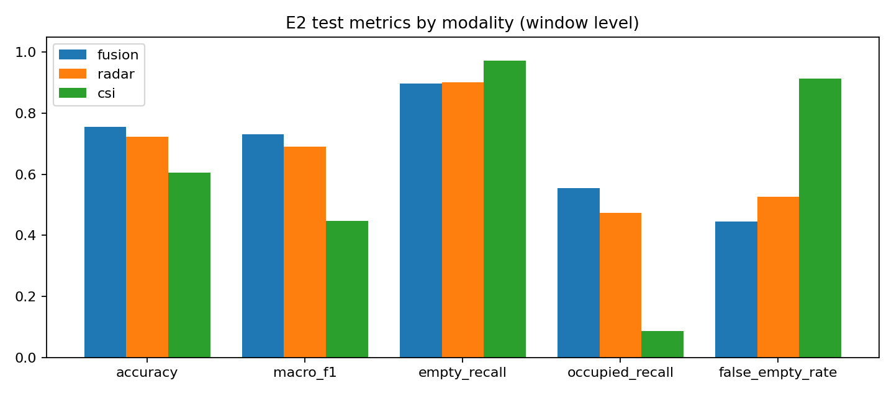
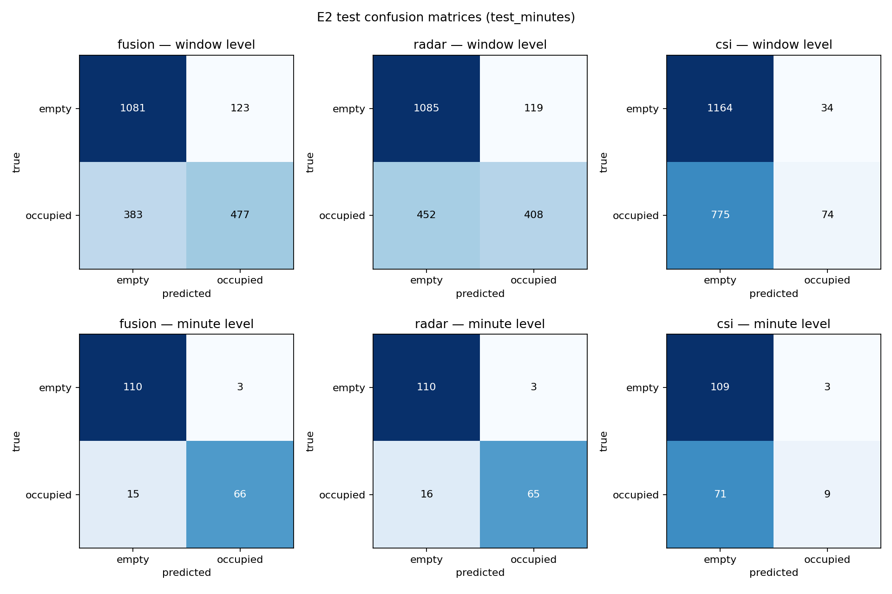
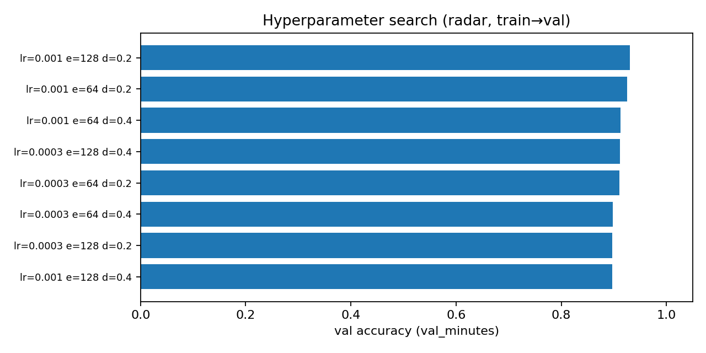
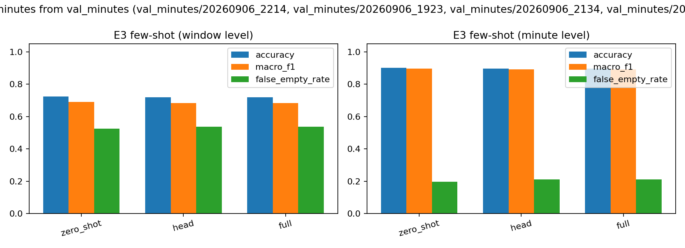

# E2 — Occupancy Detection Pipeline

Binary occupancy detection (**empty** vs **occupied** = sleep + present)
from mmWave radar + Wi-Fi CSI.

## Layout

| file | purpose |
|---|---|
| `common.py` | tolerant manifest parsing, recording discovery, label mapping, radar/CSI access |
| `inspect_dataset.py` | dataset counts + timing report -> `outputs/inspection.json` |
| `preprocess.py` | radar FFT maps + CSI windows -> per-recording cache in `cache/` |
| `models.py` | RadarEncoder (temporal-std map -> spatial pooling -> MLP), CSIEncoder (Conv1d over rolling variance of amplitude), CSIStatsEncoder (MLP on amplitude var/mean/temporal-std — the fusion CSI branch), gated fusion, binary head |
| `train.py` | split loading, train-only normalization, balancing helpers, training, metrics |
| `experiments.py` | E2 (train/val/test folders) + E3 (few-shot val->test) |
| `clean_minutes.py` | strip auto-labels, remove empty/unlabeled folders |
| `export_models.py` | TorchScript exports -> `deploy/` |
| `plots.py` | figures -> `outputs/figs/` |
| `report.py` | `outputs/REPORT.md` |
| `run_all.py` | one-command pipeline |

## Run

```powershell
pip install -r E2/requirements.txt
python E2/run_all.py            # full pipeline (~1-2 h on CPU)
python E2/run_all.py --skip-preprocess   # reuse cache
```

## Data rules (documented)

- **Splits**: `train_minutes/` (labels `t1_*`/`t2_*`) = train,
  `val_minutes/` (labels `t_*`) = validation, `test_minutes/` (labels
  `empty`/`present`) = test. Sleep counts as occupied.
- **Windows**: 50 consecutive radar frames (~5-7 s, long enough for
  breathing) inside one recording, non-overlapping. Never cross
  recordings/labels.
- **Radar timing**: `train_minutes/` — `.bin` filename is the capture
  timestamp; each file spans 1 s (frames at `ts + j/n`).
  `val_minutes/`/`test_minutes/` — per-frame npz timestamps are
  burst-flushed; frames are spread uniformly inside their
  `second_start` bucket.
- **CSI**: one receiver per recording — the `wifi_csi_XX.csv` (or npz
  receiver index) with most samples inside the minute. Amplitude of the
  52 usable subcarriers, log1p, linearly interpolated onto a 128-step
  grid spanning the radar window; windows with <2 samples are zeroed +
  flagged, never fabricated. The CSI encoder consumes **causal rolling
  variance (w=20) of amplitude** (WifiSensingESP32HAR pipeline; no
  phase).
- **Radar maps**: per frame, Hann-windowed FFT -> range-Doppler
  (64x64) and range-azimuth (16x64), log1p, resized to 24x24.
- **Features**: the encoder pools each window along time into a
  per-pixel **temporal-std map** (motion/breathing energy), then
  spatially to mean/std/max per channel. Absolute levels flip sign
  across placements and are excluded — this is what makes the model
  transfer to an unseen room.
- **Normalization**: mean/std computed on train_minutes only
  (`--norm-mode local` switches to per-recording z-score).
- **Balancing**: training windows subsampled to equal class counts;
  early stopping + threshold use a class-balanced val subsample.
- **Augmentation**: doppler-sign/azimuth flip; 30% CSI dropout (fusion).
- **Minute aggregation**: per-recording score = mean of the **top-2**
  window probabilities (a still person still moves occasionally within
  a minute; a plain mean is diluted by still windows). A separate
  `minute_threshold` is tuned on the val holdout — the median of the
  optimal range, since saturated val probs make the argmax edge
  miscalibrate on the shifted test day.
- **Threshold/early stopping/HP search**: validation (val_minutes
  holdout) only.

## Experiments

- **E2**: train on train_minutes (t1+t2) **+ 80% of val_minutes
  recordings** (test_minutes is a different day of placement t with a
  weaker occupied signal — t1+t2 alone misses it); the remaining 20%
  val holdout drives early stopping + threshold. Test on test_minutes.
  Modalities: fusion / radar-only / csi-only. The radar model is saved
  to `outputs/best_model.pt` for E3/E4.
- **E3**: fine-tune the saved E2 radar model on 10 support minutes of
  val_minutes (5 per class), evaluate on test_minutes vs the 0-shot
  baseline. Strategies: head-only, full.

## Results

### E2 — occupancy on test_minutes (different day, placement t)

Window level (n=1865):

| modality | acc | macro-F1 |
|---|---|---|
| fusion | 0.755 | 0.732 |
| radar | 0.723 | 0.690 |
| csi | 0.605 | 0.448 |

Minute level (n=194, **top-2** window aggregation, val-tuned
`minute_threshold`):

| modality | acc | macro-F1 |
|---|---|---|
| **fusion** | **0.907** | **0.902** |
| **radar** | **0.902** | **0.896** |
| csi | 0.615 | 0.471 |

The test day has a weaker occupied radar signal and a ~2x CSI gain
shift vs train/val. Two changes close the gap: (1) folding 80% of
val_minutes into training, (2) top-2 minute aggregation with its own
threshold. The conv CSIEncoder does not transfer (train_minutes has no
empty minutes with CSI), so the fusion model uses a `CSIStatsEncoder`
— an MLP on per-window amplitude variance/mean/temporal-std — whose
variance feature is the robust cross-day occupancy cue. The radar
model is exported as `outputs/best_model.pt` and is reused as stage 1
of the E4 hierarchy.

### E3 — few-shot adaptation (10 val_minutes support)

| strategy | window acc | minute acc |
|---|---|---|
| 0-shot | 0.723 | 0.902 |
| head-only | 0.722 | 0.902 |
| full fine-tune | 0.719 | 0.902 |

Fine-tuning on val support minutes does not move test_minutes — the
remaining gap is a day-shift, not a placement-shift the support set
covers.

### Plots






## Outputs

`outputs/`: `inspection.json`, `hp_search.json`, `best_config.json`,
`results_e2.json`, `results_e3.json`, `e3_partition.json`,
`best_model.pt`, `REPORT.md`, `figs/*.png`.
