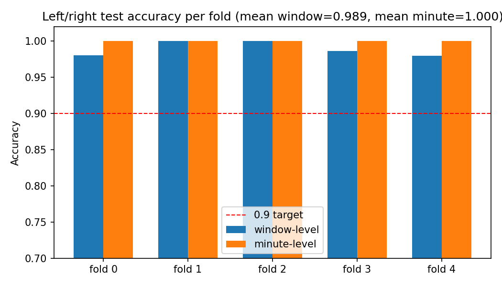
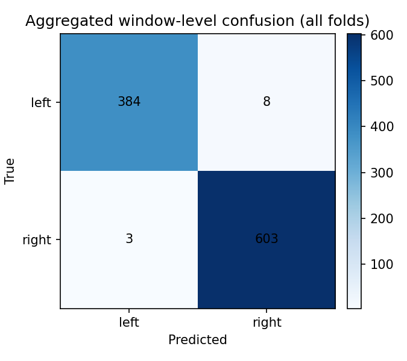
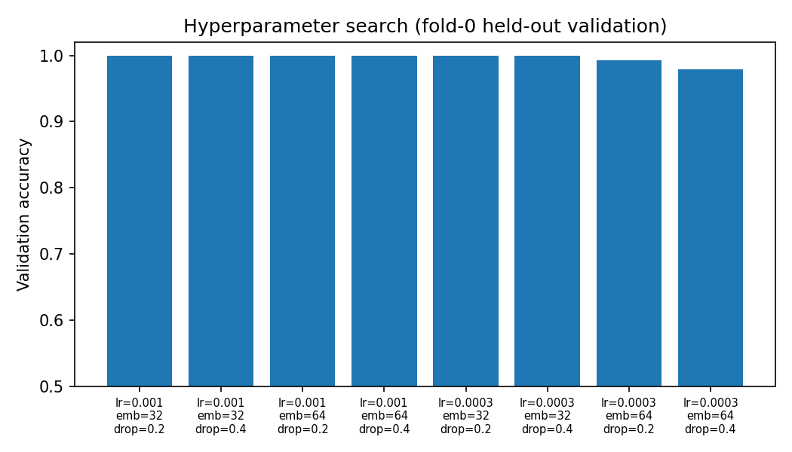
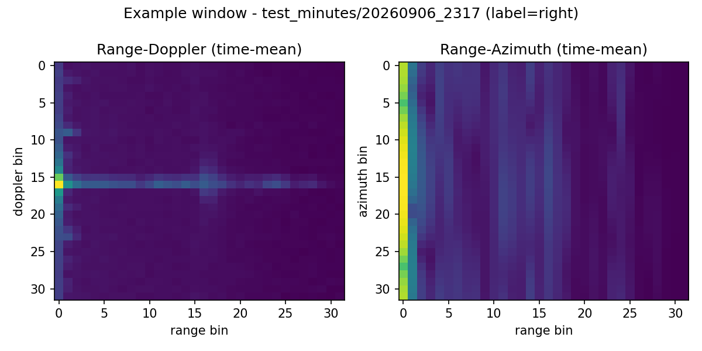

# E3 — Left/Right Localization Pipeline

Binary left/right classification of the occupant's position from mmWave
radar, using only `test_minutes/` (the only data source with a left/right
ground-truth label — see `E2/common.py` for why `minutes/` cannot be
used for this task). A small CNN is trained end-to-end on radar
range-Doppler / range-azimuth maps (a **model-based** approach, in
contrast to the hand-derived antenna-geometry angle estimate that was
tried first and only reached near-chance accuracy on this hardware/
environment).

## Layout

| file | purpose |
|---|---|
| `common.py` | manifest parsing, recording discovery (test_minutes only), dual `capture.npz` / `radar_*.bin` frame decode with real per-frame timestamps |
| `inspect_dataset.py` | dataset counts + timing report -> `outputs/inspection.json` |
| `preprocess.py` | radar FFT maps (range-Doppler + range-azimuth) + windowing -> per-recording cache in `cache/` |
| `models.py` | `LeftRightEncoder` (temporal mean+max maps -> 2D CNN) + linear head |
| `train.py` | split loading, train-only normalization, balancing, training, metrics |
| `experiments.py` | stratified group 5-fold cross-validation at the recording level, hyperparameter search |
| `plots.py` | figures -> `outputs/figs/` |
| `report.py` | `outputs/REPORT.md` |
| `run_all.py` | one-command pipeline |

## Run

```powershell
pip install -r E3/requirements.txt
python E3/run_all.py                    # full pipeline
python E3/run_all.py --skip-preprocess  # reuse existing cache
```

## Data rules (documented)

- **Data source**: only `test_minutes/` carries a left/right label; all
  84 such recordings are used (34 left, 48-50 right depending on a
  couple of ambiguous/short recordings dropped during preprocessing).
  Both on-disk radar storage formats present in this dataset are
  supported: `capture.npz` (majority) and chunked `radar_*.bin` files
  (a minority of "eventful" minutes) — real per-frame Unix timestamps
  are recovered from each format's own metadata (`radar_sample_unix_ns`
  for npz; `frame_monotonic_ns` + the minute's `capture_started` /
  `capture_started_monotonic_ns` anchor for the chunked format).
- **Windows**: 30 consecutive radar frames (~3 s), non-overlapping,
  never crossing a recording boundary.
- **Radar maps**: per frame, Hann-windowed FFT -> range-Doppler (64x64,
  averaged over antennas) and range-azimuth (32x64, zero-padded angle
  FFT across the 3 RX antennas), log1p, resized to 32x32.
- **Features**: per window, a temporal **mean** map and a temporal
  **max** map (not std, unlike E2) are computed per channel and fed to a
  small CNN. There is only one room/one radar placement for this task,
  so — unlike E2's cross-placement occupancy problem — absolute spatial
  structure is exactly the useful signal and must NOT be discarded.
- **Cross-validation**: stratified group 5-fold at the RECORDING level
  (never split a minute's windows across folds). Each fold carves a
  further 80/20 train/val split from its training recordings for early
  stopping and threshold selection; the held-out test fold is scored
  exactly once.
- **Balancing**: training windows subsampled to equal left/right counts;
  the validation subsample used for early stopping/threshold selection is
  also class-balanced.
- **Augmentation**: label-preserving only — random small circular shift
  along the range axis, random time-reversal. A left/right mirror flip
  is deliberately NOT used since it would flip the ground-truth label.
- **Hyperparameter search**: grid search on an internal validation split
  carved out of fold 0's training recordings only; the winning config is
  then frozen and reused unchanged for every fold's final run.

## Results (stratified group 5-fold CV, recording-level)

| metric | mean | std | per-fold |
|---|---|---|---|
| window accuracy | **0.989** | 0.009 | 0.980 / 1.000 / 1.000 / 0.986 / 0.980 |
| minute accuracy | **1.000** | 0.000 | 1.000 / 1.000 / 1.000 / 1.000 / 1.000 |
| window macro-F1 | 0.989 | | |
| minute macro-F1 | 1.000 | | |

Every fold clears the 0.9 accuracy target at both levels; minute-level
accuracy is 100% in all folds (majority vote over ~7-15 windows per
minute erases the rare per-window errors).

### Plots






See `outputs/REPORT.md` for the full per-fold breakdown.

## Outputs

`outputs/`: `inspection.json`, `hp_search.json`, `best_config.json`,
`fold_assignment.json`, `results_kfold.json`, `model_fold*.pt`,
`REPORT.md`, `figs/*.png`.
