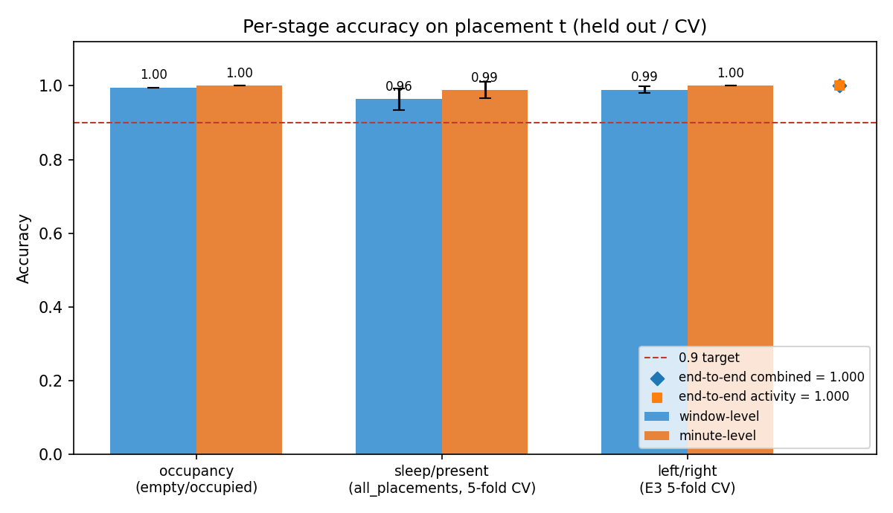
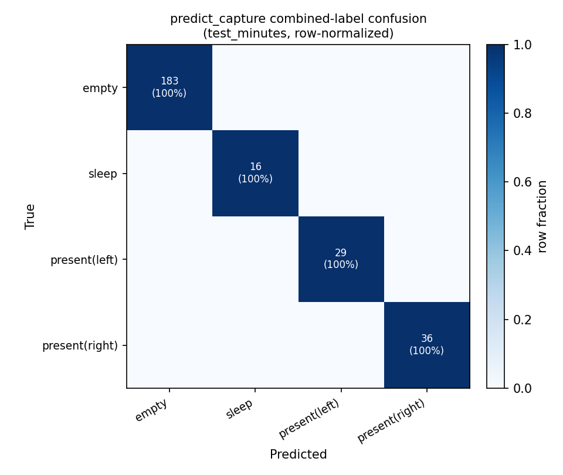
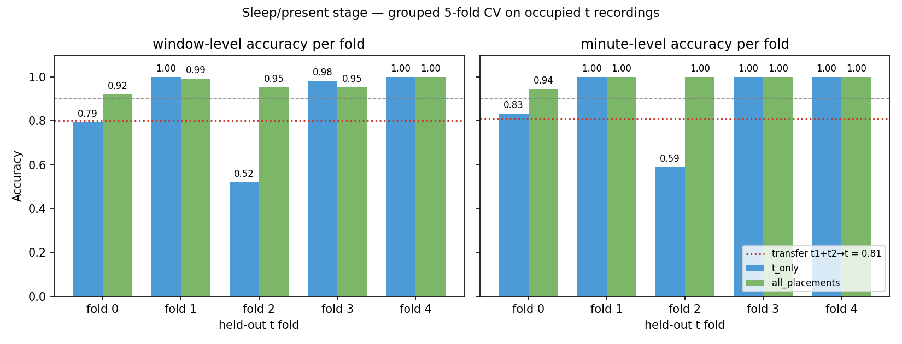
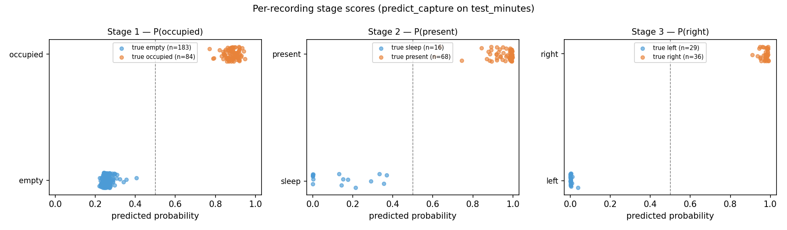
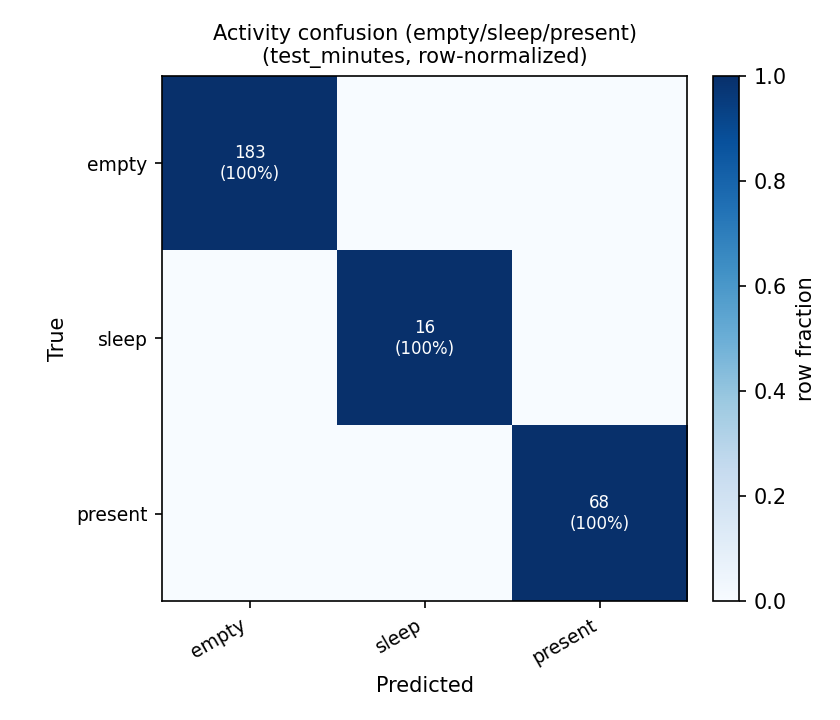
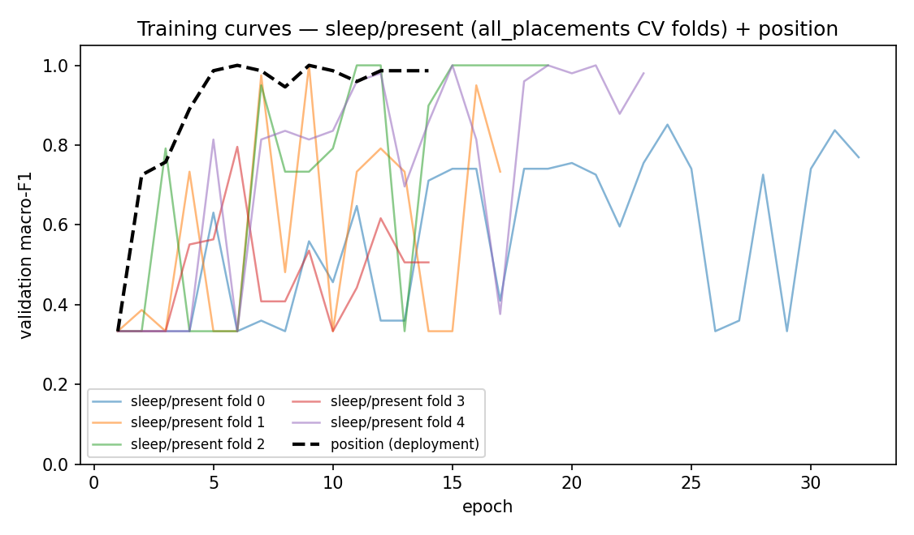

# E4 — Hierarchical Activity + Position Pipeline

Single inference function mapping a `capture.npz` recording to a combined
label: **empty** | **sleep** | **present(left)** | **present(right)**.

```python
from E4.predict import predict_capture
label = predict_capture("test_minutes/20260906_2317/capture.npz")
```

## Task

Compose three radar models into a hierarchy:

1. **Occupancy** (empty vs occupied) — E2's exported `best_model.pt`
   (radar-only, trained on t1 / validated on t2). Not retrained.
2. **Sleep vs present** — binary CNN run only when stage 1 says occupied.
3. **Left/right** — E3-style model trained on t (the only placement with
   left/right labels), run only when stage 2 says present. Only
   `t_present` recordings carry left/right ground truth, so they are the
   only data that can validate location.

## Stage-2 redesign (why)

The original stage 2 was trained on occupied **t1+t2** and tested on t —
it collapsed to **0.37** accuracy: the occupied class prior inverts
(train ≈85% sleep, test ≈80% present) and the spatially-pooled
temporal-std features that make occupancy transfer do not separate sleep
from present on an unseen placement.

The redesigned stage instead treats t as the deployment domain (same
protocol as the position stage):

- **Encoder** — `MapStatsEncoder`: temporal mean+max+std maps → 2D CNN.
  Keeps *where* motion happens, which is informative (not a shortcut)
  once the model trains on the deployment placement.
- **Evaluation** — stratified group 5-fold CV over the 84 occupied t
  recordings (recording-level folds, no leakage). Two training-data
  variants are compared: `t_only` vs `all_placements` (each fold's train
  set + all occupied t1+t2). Winner: **`all_placements`** — the extra
  placements regularize the CNN even though they cannot drive it alone.
- **Deployment** — ensemble of the 5 fold models (probabilities averaged
  over models × windows). A single full-data retrain was tried and
  discarded: with ~70 training recordings the tiny val split occasionally
  collapses training, while the fold models are already validated.
- **Threshold** — tuned on **out-of-fold ensemble** predictions: each
  recording scored only by the fold models that never trained on it,
  aggregated to per-recording mean probability (the same quantity
  `predict_capture` thresholds). OOF separation is clean: hardest sleep
  p=0.45, hardest present p=0.63 → thr = **0.46**.

Two preprocessing bugs in `predict_capture` were also fixed — they made
fresh `capture.npz` decodes differ from the E2/E3 training caches:

- **Frame order** — was sorted by `radar_sample_unix_ns` (burst-flushed,
  unreliable). Now ordered by `radar_sample_sequence` (hardware order)
  with timestamps reconstructed from per-second buckets, matching E2.
- **Azimuth fftshift** — `frames_to_maps` always shifted the azimuth FFT,
  but the E2 cache was built *without* the shift (E3's *with* it). The
  shift is invisible to occupancy's spatial pooling but corrupts the
  stage-2 CNN's spatial input. Now parameterized per spec.

## Layout

| file | purpose |
|---|---|
| `common.py` | label parsing, `capture.npz` frame decode (sequence-ordered), parameterized FFT maps + windowing |
| `models.py` | `OccupancyModel` (loads E2 export), `SleepPresentModel` (map-stats CNN), `PositionModel` (E3-style CNN) |
| `train.py` | evaluates E2 export on t; sleep/present grouped-CV + ablation + ensemble; position on all t |
| `predict.py` | `predict_capture(npz_path)` — the 3-stage inference function |
| `evaluate.py` | runs `predict_capture` on every `test_minutes` npz and reports accuracy |
| `plots.py` | figures -> `outputs/figs/` |
| `run_all.py` | one-command pipeline |

## Run

```powershell
# prerequisites: E2 and E3 caches + E2 exported model must exist
python E2/run_all.py
python E3/run_all.py

python E4/run_all.py
```

## Results

Per-stage accuracy on `test_minutes/` (placement t):

| stage | task | protocol | window acc | minute acc |
|---|---|---|---|---|
| 1 | empty vs occupied | E2 export (train t1, val t2) → test t | **0.995** | **1.000** |
| 2 | sleep vs present | grouped 5-fold CV on occupied t (`all_placements`) | **0.964** | **0.989** |
| 3 | left vs right | E3 grouped 5-fold CV on t | **0.989** | **1.000** |

Stage-2 CV ablation (minute acc): `all_placements` **0.989** vs `t_only`
0.884 vs old transfer design (train t1+t2 → test t, diagnostic) 0.810.

End-to-end `predict_capture` on the 267 `test_minutes` recordings with a
`capture.npz`:

| metric | value | previous |
|---|---|---|
| combined 4-way accuracy | **1.000** | 0.801 |
| activity 3-way accuracy (empty/sleep/present) | **1.000** | 0.801 |
| position coverage (65 labeled `t_present` recs) | **1.000** | 0.215 |
| position accuracy when emitted | **1.000** | 1.000 |

Confusion: 183/183 empty, 16/16 sleep, 29/29 present(left),
36/36 present(right) — zero errors.

### Plots








## Outputs

`saved_models/`: `sleep_present_model.pt` (5 fold state_dicts + norms +
OOF-ensemble threshold), `position_model.pt` (weights + norm + threshold).
Stage 1 loads `E2/outputs/best_model.pt` directly.
`outputs/`: `results_e4.json`, `predict_capture_eval.json`, `figs/*.png`.
